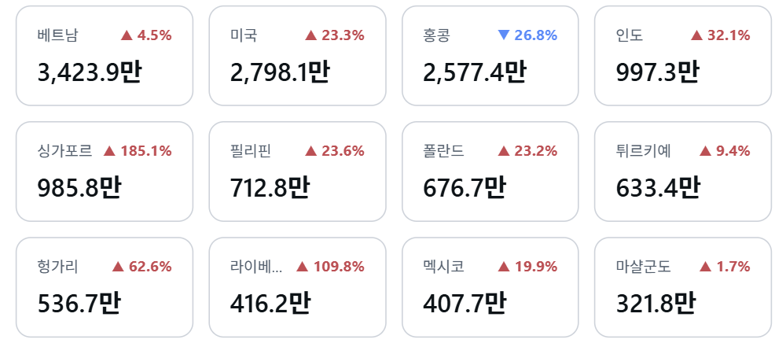
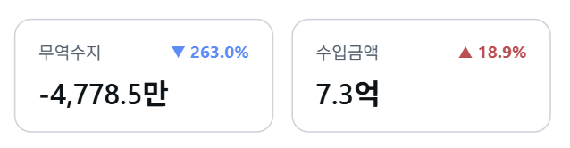

# Power BI Custom Card List Visual

Power BI용 커스텀 카드 리스트 비주얼.  
하나 이상의 값을 카드 형태로 나열하고, 전기(전년) 대비 증감(YoY)을 화살표와 색상으로 표시 가능

|예시| 이미지 |
|---|---|
|Category 지정||
|Category 미지정||

---

## 기능

- **데이터 구성 방식 두 가지**
  - Category를 지정하면 카테고리별로 카드 하나씩 생성 (예: 국가별 무역수지)
  - Category 없이 Value에 여러 측정값을 넣으면 측정값별로 카드 하나씩 생성 (예: 당년 무역수지/수입금액)
- **전년/전기 대비(YoY) 표시**: `▲`/`▼`와 증감률(%)을 값 아래, 값 오른쪽, 제목 오른쪽 중 원하는 위치에 표시할 수 있음. 증가/감소 색상 지정 가능
- **한국어 숫자 단위 자동 표시**: 보고서 언어가 한국어일 때 천/만/억/조 단위로 자동 변환 (Power BI 기본 3자리 대신 한국식 4자리 사용)
- **레이아웃**: 자동(반응형) 또는 고정 열 수, 카드 너비/높이, 자동/수동 패딩, 카드 간 좌우·상하 여백 조정
- **카드 스타일**: 배경색·투명도, 테두리 색상·두께·모서리 반경
- **글꼴 커스터마이징**: 제목/값/YoY 각각에 대해 글꼴, 크기, 굵게/기울임/밑줄, 색상 지정
- **선택 및 툴팁**: 카드를 클릭하면 다른 시각화와 교차 필터링되며, 마우스 오버 시 상세 툴팁 표시

---

## Format 옵션 구조

- **카드 스타일**: 배경(색상/투명도), 테두리(색상/두께/모서리 반경)
- **카드 제목**: 제목 표시 여부, 글꼴, 색상
- **값 표시**: 글꼴, 색상, 소수 자릿수, 한국어 표시 단위(자동/없음/천/만/억/조)
- **레이아웃**: 배치 모드(자동/고정 열 수), 크기(카드 너비/높이), 여백(자동/수동 패딩), 카드 간 여백(좌우/상하)
- **전년 대비 (YoY)**: 표시 여부, 글꼴, 증가/감소 색상, 표시 위치(값 아래/값 오른쪽/제목 오른쪽)

---

## Data Roles

| 역할 | 이름 | 종류 | 설명 |
|---|---|---|---|
| Category | `category` | Grouping | 카드 1개 = 카테고리 1개. 생략 시 측정값별 카드 모드로 전환 |
| Value | `measure` | Measure | 카드에 표시할 값. Category 없이 여러 개 넣으면 값마다 카드 생성 |
| Prior Period Value | `priorMeasure` | Measure | YoY 계산에 쓰이는 비교 기준값(전년/전기) |

> Category 없이 여러 Value를 넣은 경우, 서식 창의 "값별 설정"에서 각 카드마다 짝지을 Prior Period 필드와 YoY 표시 여부/위치/색상을 각각 지정할 수 있음.

---

## 개발 환경

- TypeScript + [Power BI Visuals API](https://github.com/microsoft/PowerBI-visuals-tools) (`powerbi-visuals-api` ~5.3.0)
- [powerbi-visuals-utils-formattingmodel](https://github.com/microsoft/powerbi-visuals-utils-formattingmodel) 기반 서식 창(Format pane)
- D3.js (툴팁/선택 바인딩), LESS (`style/visual.less`)

### 요구 사항

- Node.js
- [powerbi-visuals-tools](https://www.npmjs.com/package/powerbi-visuals-tools) (`pbiviz`) — 글로벌 설치 필요, `npm install -g powerbi-visuals-tools`

### 설치

```bash
npm install
```

### 개발 서버 실행

```bash
npm start
```

Power BI Service의 Developer Visual에서 이 로컬 서버에 연결해 확인하는 방식.

### 패키징 (.pbiviz 생성)

```bash
npm run package
```

### 린트

```bash
npm run lint
```

## 프로젝트 구조

```
src/
  visual.ts      # 렌더링 로직 (카드 생성, YoY 계산, 값 포맷팅, 선택/툴팁 처리)
  settings.ts     # 서식 창(Format pane) 설정 모델
style/
  visual.less     # 카드 스타일
capabilities.json # 데이터 역할 및 서식 객체(objects) 정의
pbiviz.json        # 비주얼 메타데이터(이름, 버전, 아이콘 등)
```